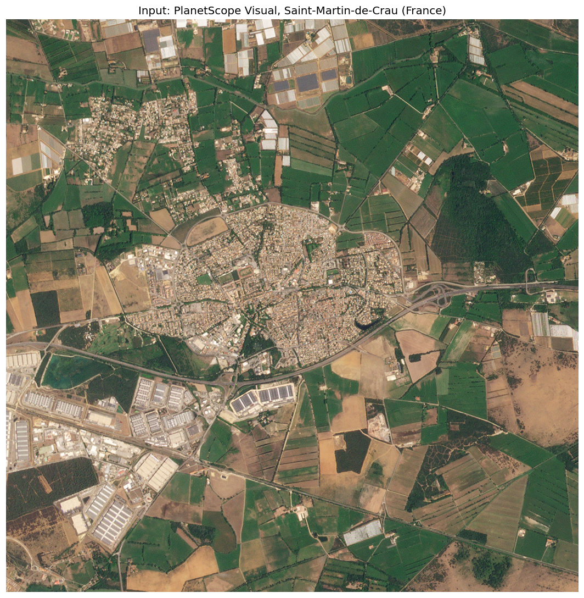
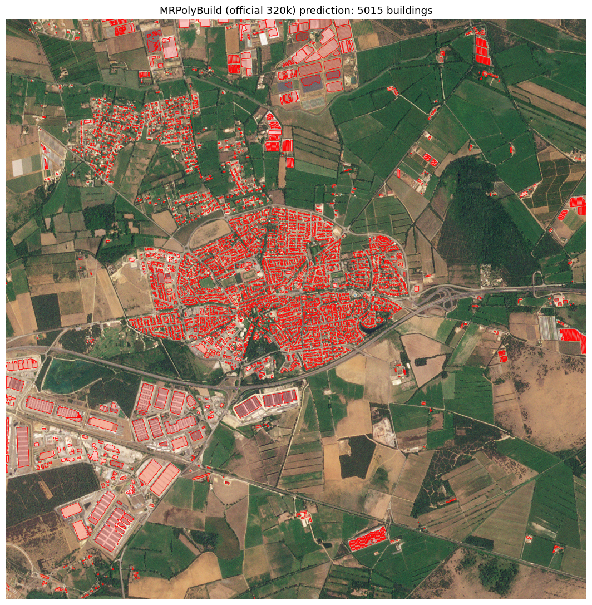
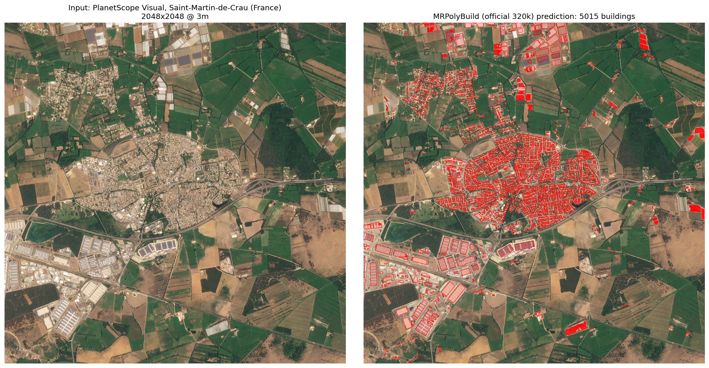
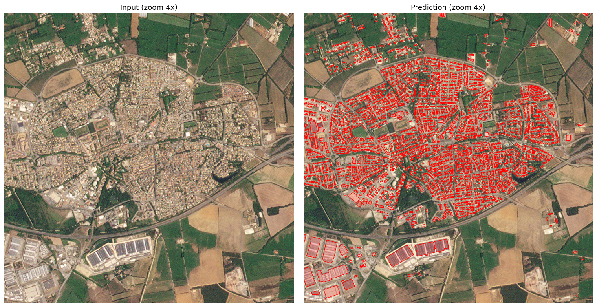

# MRPolyBuild

Official repository for paper "Rethinking Resolution: Large-Scale Polygonal Building Detection Using Medium-Resolution (3-5m) Satellite Data".

<p align="center">
  
</p>

## News

- **2026-08**: Released training/test annotations, official checkpoints, evaluation code and a single-image inference demo.

## Downloads

All released assets are hosted in the [MRPolyBuild Google Drive folder](https://drive.google.com/drive/folders/1Btc_uM3l4dfyrUOOH2NHv62Sejkkvwhj).
Checksums of every file are provided in `SHA256SUMS.txt` at the folder root.

### Annotations (satellite imagery is **not** redistributed)

| File | Description | Link |
|---|---|---|
| `data/mrpolybuild_merged_ann.tar.zst` (~15 GB) | 162,531 per-tile building annotations fused from Microsoft, Google and CLSM datasets | [link](https://drive.google.com/open?id=1hEn0lcOi1uVqnHCyy9lmLYAi75raWlFo) |
| `data/test_6k_osm.tar.zst` (~909 MB) | OSM annotations for the 6k test tiles | [link](https://drive.google.com/open?id=1FnvwOerZ8R5uqKMa-zjrGMRw8Axxz37P) |
| `data/train_roi.geojson` | Training RoI polygons | [link](https://drive.google.com/open?id=1doWce5DMl6P3s0WSEJpp0ZJ6l1eyMUL8) |
| `data/test_roi.geojson` | Test RoI polygons | [link](https://drive.google.com/open?id=1OJ9f0E9VmWodNPQ0VFIIHsX4QgGepIu9) |
| `data/test_6k_metrics.tar.zst` | Evaluation metric summaries | [link](https://drive.google.com/open?id=1gsVUsbiu_nojeWSC7lukjTYcdJUjwFLO) |
| `data/coco_no_ann.json` | Test image list (COCO format) | [link](https://drive.google.com/open?id=1lms5rlj-PcFCBoboJcIAmUjDgwS0fitW) |

### Checkpoints

| Model | File | Size | Link |
|---|---|---:|---|
| Stage-1 semantic segmentation (50 epochs) | `checkpoints/seg-based-det_8x_multi-source_convnext-v2-b_50e_planet_basemap_global/epoch_50.pth` | 2.0 GB | [link](https://drive.google.com/open?id=17b38KVuc16nFMHYwCEdyf-D-72xNVv97) |
| Stage-2 polygon refinement (320k iterations) | `checkpoints/gcp_ins-v2_8x_right-ang-v2_seg-based-det_convnext-v2-b_320k_planet_basemap_global/iter_320000.pth` | 1.1 GB | [link](https://drive.google.com/open?id=1lrFQnFRdEp7bqXpzX5FCgbgx3NysCffw) |

### Demo

| File | Link |
|---|---|
| Predicted GeoJSON for the demo tile | [link](https://drive.google.com/open?id=1_SdqniNY3BGpiVxugJgETSRObNSNNRVp) |
| Sample PlanetScope tile (Saint-Martin-de-Crau, France) | downloaded & cropped by `bash demo/download_demo_data.sh` from the [ESA public sample](https://earth.esa.int/eogateway/missions/planetscope/sample-data) (not redistributed here) |

## Installation

First, create a conda environment:

```
conda env create -f environment.yaml -n MRPolyBuild
```

Then install the package:

```
pip install -e .
```

Extra dependencies required for evaluation:

```
pip install -r requirements/polygon.txt
```

## Data Preparation

The satellite images used in this work are from PlanetScope company, which are commercial data. Hence we are not allowed to publish them here. We do provide the annotation files and RoI files that can be used to search the corresponding tiles from PlanetScope imagery, and building polygon results of our method and comparison methods that can be used to reproduce the evaluation metrics in the paper.

### Download

Download the annotation files from the [Drive folder](https://drive.google.com/drive/folders/1Btc_uM3l4dfyrUOOH2NHv62Sejkkvwhj) (or use the per-file links above) and extract them:

```
mkdir -p data
tar --use-compress-program=unzstd -xf mrpolybuild_merged_ann.tar.zst -C data
tar --use-compress-program=unzstd -xf test_6k_osm.tar.zst -C data
```

The resulting directory structure is:

```
data/
├── train_roi.geojson
├── test_roi.geojson
├── train_160k/
│   ├── img/                  # not provided, see below
│   ├── merged_ann/           # 162,531 per-tile annotation jsons
│   └── ...
└── test_6k/
    ├── img/                  # not provided, see below
    ├── osm/geojson/          # test annotations (GeoJSON)
    ├── osm/json/             # test annotations (JSON)
    └── ...
```

`train_roi.geojson` and `test_roi.geojson` are lists of bounding box RoIs that define the sampling regions of the training and testing data, and can be used to download the corresponding tiles from publicly available data sources. `data/train_160k/merged_ann` contains the building annotations fused from the Microsoft, Google and CLSM datasets, one JSON file per tile, with the filename matching the tile image filename.

No satellite images are provided. To train or test with your own networks, prepare the image tiles in `.tif` format and place them in `img/`, making sure the image and annotation filenames are paired.

## Checkpoints

Download the checkpoints and place them under `checkpoints/`, keeping the directory names shown in the table above, e.g.:

```
checkpoints/gcp_ins-v2_8x_right-ang-v2_seg-based-det_convnext-v2-b_320k_planet_basemap_global/iter_320000.pth
```

The Stage-2 checkpoint is an end-to-end model (backbone + segmentation head + polygon refinement head). When training the Stage-2 model yourself, set the `load_from` variable in the Stage-2 config to the Stage-1 checkpoint path.

## Evaluation

To reproduce the evaluation metrics in the paper, run:

```
python tools/eval_planet_metrics_by_geojson_list.py \
    --product-name gcp_ins-v2_8x_right-ang-v2_320k \
    --pred-geojson-pattern "data/test_6k/{product_name}/geojson/*.geojson" \
    --gt-geojson-pattern "data/test_6k/osm/geojson/*.geojson" \
    --out-base-path "data/test_6k/metrics/{product_name}"
```

Notes:

- `--product-name` can be passed multiple times to evaluate several prediction products in one run.
- The `Globe` filter is evaluated by default; continent/country filters can be enabled inside the script.
- Results are written to `overall_Globe.json` and `summary_table.txt` in the output directory.
- `--match-mode` selects whether to pair predictions with ground truth by common files (`common`) or by all ground-truth files (`gt_driven`).

## Train

Training MRPolyBuild includes the following two steps.

### Train Semantic Segmentation Networks

In the first stage, we train a plain semantic segmentation network by running:

```
python tools/train.py configs/planet_basemap/seg-based-det_8x_multi-source_convnext-v2-b_50e_planet_basemap_global.py
```

You will need to change the `data_root` in `configs/_base_/datasets/planet_basemap_single_ann_2023q2_global_8x_train-160k.py` to your data directory.

### Train Polygon Refinement Networks

In the second stage, we train the polyline refinement module by running:

```
python tools/train.py configs/planet_basemap/gcp_ins-v2_8x_right-ang-v2_seg-based-det_convnext-v2-b_320k_planet_basemap_global.py
```

Make sure you have specified the `load_from` variable to the network weights achieved in the first stage.

## Inference

### Quick Start — Single-Image Inference

1. Download the Stage-2 checkpoint and place it under `checkpoints/` (see [Checkpoints](#checkpoints)).
2. Download and crop the demo tile (original image from the [ESA public PlanetScope sample](https://earth.esa.int/eogateway/missions/planetscope/sample-data)):

```
bash demo/download_demo_data.sh
```

3. Run the inference:

```
python tools/inference_planet_basemap.py demo/configs/inf_demo.py
```

The demo config processes `demo/data/saint_martin_de_crau_town.tif`, a 2048x2048 PlanetScope visual tile (Saint-Martin-de-Crau, France), with the official 8x upsampled inference pipeline (256x256 crops upsampled 8x to 2048x2048, assembled at 8x output resolution).

Input | MRPolyBuild prediction (5,015 buildings)
--- | ---
 | 

Input / prediction side-by-side and a 4x zoom of the town centre:





The predicted polygons are saved as GeoJSON at:

```
demo/output/gcp_ins-v2_8x_right-ang-v2_320k_demo/geojson/saint_martin_de_crau_town.geojson
```

### Inference with PlanetScope Satellite Images

To run inference on large satellite images, specify a folder containing `.tif` files. Refer to the configuration file `configs/planet_basemap/inf_gcp_ins-v2_8x_right-v2_convnext-v2-b_320k_planet_basemap_filtered_oceania.py` for details.

After the data path is configured, the inference pipeline can be run using:

```
python tools/inference_planet_basemap.py configs/planet_basemap/inf_gcp_ins-v2_8x_right-v2_convnext-v2-b_320k_planet_basemap_filtered_oceania.py
```

### Inference with Existing Probability Maps

We provide a model that can perform zero-shot building polygonal mapping from building probability maps (usually generated by a neural network).

Here we provide an example of converting building probability maps from the Google 2.5D Temporal dataset to polygonized buildings:

```
python tools/inference_planet_basemap_from_tif_probs.py configs/planet_basemap/inf_gcp_ins-v2_8x_right-v2_convnext-v2-b_320k_planet_basemap_google25d.py
```

You may want to configure the paths in the `save_cfg` variable in the configuration file.
