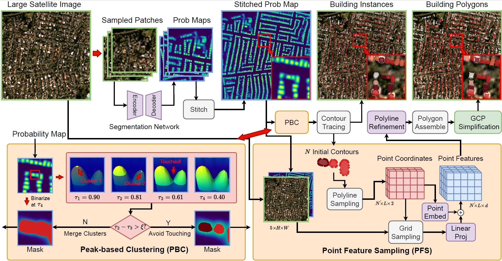

Official repository for paper "Rethinking Resolution: Large-Scale Polygonal Building Detection Using Medium-Resolution (3-5m) Satellite Data".
<p align="center">
  
</p>

## Installation
First, we need to create a conda environment using the following commands.
```
conda env create -f environment.yaml -n MRPolyBuild
```

Later on, simply install MRPolyBuilding by running `pip install -e .`

## Data Preparation
The satellite images used in this work are from PlanetScope company, which are commercial data. Hence we are not allowed to publish them here. 
Yet we do provide a list of annotation files and RoI files which can be used to search corresponding tiles from PlanetScope imagery.
Additionally, we provide building polygon results of our method and other comparison methods, which can be used to reproduce the evaluation metrics in the paper.

Data can be downloaded from... They have the following structure:

```
data/
├── train_roi.geojson
├── test_roi.geojson
├── train_160k/
│ ├── img/
│ ├── merged_ann/
│ ├── ...
├── test_6k/
│ ├── img/
│ ├── osm/
│ ├── ...
work_dirs/
├── .../
```
where train_roi.geojson and test_roi.geojson are a list of bounding box RoIs that define the sampling region of training and testing data. Which can be used to download data from publicly available data sources.

`data/train_160k` and `data/test_6k` contain the training and testing annotations and other data. 

`data/train_160k/merged_ann` contains the building annotations fused using Microsoft, Google and CLSM datasets.

There is not images provided. In order to train your own networks, image data should be prepared in .tif format and placed in `img/`. Make sure the filename of annotations and images paired.

## Evaluation
To reproduce the evaluation metrics in the paper, simply run:
```
python tools/eval_planet_metrics_by_geojson_list.py
```
You are able to change the products and continents to be evaluated inside the file.

## Train
Training MRPolyBuild includes the following two steps.

### Train Semantic Segmentation Networks
In the first stage, we train a plain semantic segmentation network by running:
```
python tools/train.py configs/planet_basemap/seg-based-det_8x_multi-source_convnext-v2-b_50e_planet_basemap_global.py
```
You will need to change the `data_root` in `configs/_base_/datasets/planet_basemap_single_ann_2023q2_global_8x_train-160k.py` to your data directory.

### Train Polygon Refinement Networks
In the second stage, we train the polyline refinement module by running:
```
python tools/train.py configs/planet_basemap/gcp_ins-v2_8x_right-ang-v2_convnext-v2-b_320k_planet_basemap_global.py
```

Make sure you have specified the `load_from` variable to the network weights achieved in the first stage.

## Inference
We provide codes for inferencing on large satellite images. Specifically, two types of inference mode are supported. 

### Inference with PlanetScope Satellite Images
In order to inference on large satellite images, one will have to specify a folder containing .tif files corresponding satellite images.
On can refer to the configuration file in `configs/planet_basemap/inf_gcp_ins-v2_8x_right-v2_convnext-v2-b_320k_planet_basemap_filtered_oceania.py` for more details.

After the data path is configured, inference pipeline can be run using:
```
python tools/inference_planet_basemap.py configs/planet_basemap/inf_gcp_ins-v2_8x_right-v2_convnext-v2-b_320k_planet_basemap_filtered_oceania.py
```

### Inference with Existing Probability Maps
We provided a model solely trained using 
